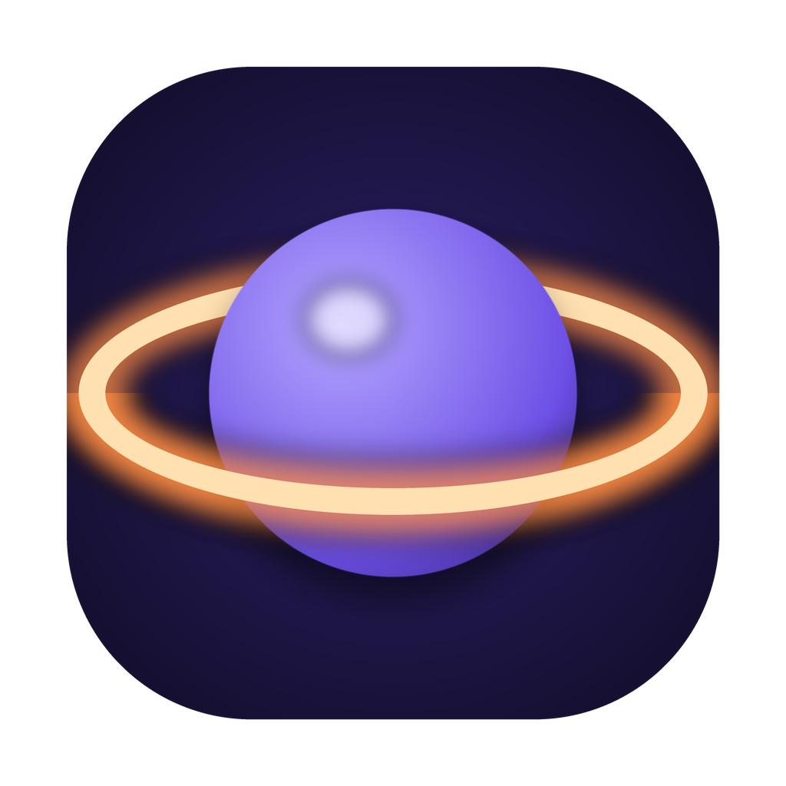
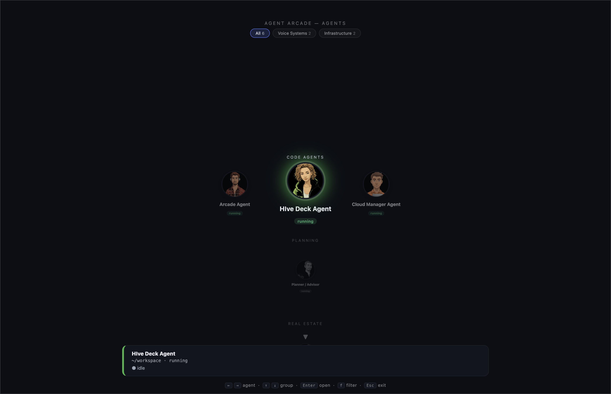

<p align="center">
  
  <br/>
  <h1 align="center">Agent Arcade</h1>
  <h3 align="center"><em>"Voice-driven mission control for your AI coding agents."</em></h3>
  <p align="center">Navigate a roster of agents by avatar, <strong>talk</strong> to any one of them, and drive its terminal — dictation, typed macros, and a live terminal, all in one arcade.</p>
</p>

---

<p align="center">
  🎙️ <strong>Dictate to any agent</strong> — speak, and your words land in the right agent's terminal<br/>
  🕹️ <strong>One surface, many agents</strong> — a grouped, avatar-driven roster you fly through by keyboard<br/>
  ⚡ <strong>Typed <code>@</code>-macros</strong> — pinned commands with <em>select / text / flag / fixed</em> args, run in the agent's shell<br/>
  🖥️ <strong>Live terminal · sync · pop-out</strong> — watch output, forward every keystroke, or detach a full WezTerm window<br/>
  🔋 <strong>Batteries included</strong> — bundles a notarized WezTerm + a Go dictation bridge; <code>npm i -g</code> and go
</p>

---

<p align="center">
  
  <br/>
  <sub>The Arcade — your agents, grouped and navigable, each with its own avatar and live status.</sub>
</p>

---

## What it is

Agent Arcade is a desktop control surface for a fleet of AI coding agents. Each agent is a live CLI session — think **Claude** — running in its own terminal pane. Register them once (grouped by system and purpose, each with a generated avatar), then summon the Arcade from your menu bar and:

- 🎙️ **Talk to the selected agent.** Press to record; your speech is transcribed and routed straight into that agent's terminal — raw, or cleaned up first, per agent.
- ⚡ **Fire a macro.** Pinned `@`-commands drop a real shell command — with prompted, typed arguments — into the agent's workspace shell for you to review and run.
- 🖥️ **Drive the terminal.** Peek at live output, flip to **Sync** so every keystroke goes to the pane, or **pop out** a full WezTerm window sized to match the Arcade.

You never leave the keyboard, and you never lose track of which agent is doing what.

---

> **"Fire `@TenantApply`, step 3."**

Select the agent, trigger the macro, answer the one prompt (`step: 3`), and the composed command lands in its shell — reviewed, then run. Meanwhile another agent is mid-build two avatars over. Same surface, no context lost.

---

## Install

Agent Arcade ships as a public npm package with everything it needs **bundled** (a notarized WezTerm + the Go dictation bridge) — no external terminal, no separate install.

```sh
npm install -g @talkersoft-com/agent-arcade
agent-arcade          # starts the menu-bar launcher
```

Summon the Arcade any time with **⌘⌥A**.

### Requirements

- **macOS** (Apple Silicon or Intel)
- **Node.js 18+**
- A **speech-to-text endpoint** for dictation — point `api_url:` at any host running the ASR API (e.g. `http://localhost:9100`). Everything else works without it.

---

## The three surfaces

<table width="100%">
<tr>
<td width="33%" align="center"><h3>🪐 Arcade</h3></td>
<td width="33%" align="center"><h3>🖥️ Live Terminal</h3></td>
<td width="33%" align="center"><h3>🎛️ Studio</h3></td>
</tr>
<tr>
<td align="center"><small>A fullscreen roster of your agents. Fly between them and groups by keyboard, see live status, and dictate or fire a macro at whichever one is selected.</small></td>
<td align="center"><small>Peek at an agent's output, flip to <strong>Sync</strong> (every keystroke → the pane), or pop out a full WezTerm window. Drag files onto it to paste absolute paths.</small></td>
<td align="center"><small>The config app: agents, systems &amp; groups, dictation, multi-monitor placement, and per-agent diagnostics — all persisted to a hand-editable YAML.</small></td>
</tr>
</table>

---

## Macros

A macro is a named `@`-command scoped to an agent. It composes a shell command from **typed, prompted arguments** and drops it into the agent's workspace shell (with an optional review-before-run gate). Pinned macros show up as chips the moment that agent is selected.

| Arg type | Behavior |
|---|---|
| **select** | Pick from a fixed list of options |
| **text** | Free user-entered value |
| **flag** | ON/OFF toggle that emits a literal token (e.g. `--force`) — omitted when off |
| **fixed** | A hard-coded value substituted verbatim, **never prompted** |

```yaml
# ~/.hv/agent-arcade.yaml  (excerpt)
commands:
  - name: BuildApi
    agent_id: <agent-uuid>
    cwd: ~/workspace/my-service
    run: npm --prefix api run build
    pinned: true
    confirm: true          # review in the shell, then press ↵ to run

  - name: Deploy
    agent_id: <agent-uuid>
    cwd: ~/workspace/my-service
    run: python deploy.py {target} {dry}
    pinned: true
    confirm: true
    args:
      - { key: target, label: Target, type: select,
          options: [{ value: staging }, { value: prod }] }
      - { key: dry, label: Dry run, type: flag, flag: "--dry-run" }
```

---

## Keyboard

| Where | Keys |
|---|---|
| **Anywhere** | `⌘⌥A` summon / hide the Arcade |
| **Arcade** | `← →` agent · `↑ ↓` group · `Enter` open · `f` filter · `Esc` exit |
| **Terminal** | `Enter` send · `⌘F` sync · `⌘W` workspace shell · `⌘E` expand · `Esc` close |
| **Sync mode** | every key → the pane (incl. `Esc`) · `⌘A` exit |
| **Dictation** | press to record · release / `⌘D` to send · `Esc` to cancel |

---

## Configuration

All state lives in a single, hand-editable YAML at `~/.hv/agent-arcade.yaml` — agents, systems, groups, monitor placement, and macros. A minimal shape:

```yaml
api_url: http://localhost:9100     # your speech-to-text endpoint

agents:
  - id: <uuid>
    name: My Agent
    program: claude
    cwd: ~/workspace
    group_id: <group-uuid>
    text_cleanup: false            # straight dictation, or true to clean up first

systems:                           # a machine an agent runs on (mac / linux)
  - { id: <uuid>, name: Local, os: mac }

groups:                            # how agents are bucketed in the Arcade
  - { id: <uuid>, name: Code Agents, order: 0, active: true }
```

Displays (which monitor the Arcade opens on, and where a popped-out terminal lands) are configured in **Studio → Displays** and saved back to the same file.

---

## Credits

Agent Arcade stands on excellent open-source work:

- **[WezTerm](https://wezterm.org)** — the bundled terminal (© Wez Furlong, MIT). The notarized `WezTerm.app` is redistributed verbatim.
- **[xterm.js](https://xtermjs.org)** — the embedded terminal renderer (MIT).
- **[XState](https://stately.ai/docs/xstate)** — the state machines behind the UI (MIT).

---

## License

[MIT](LICENSE) © talkersoft. WezTerm is redistributed under its own MIT license (see `LICENSE`).
